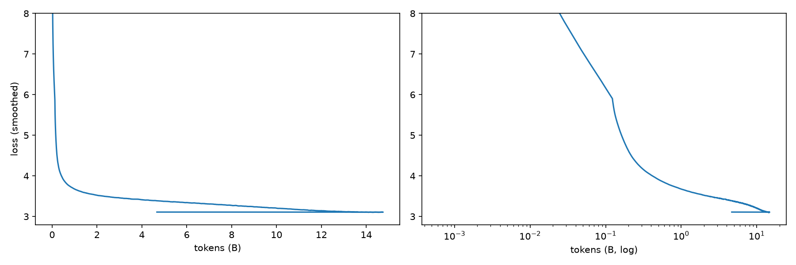
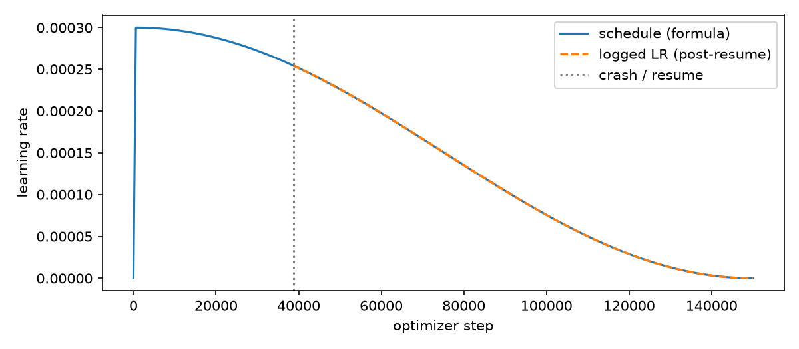
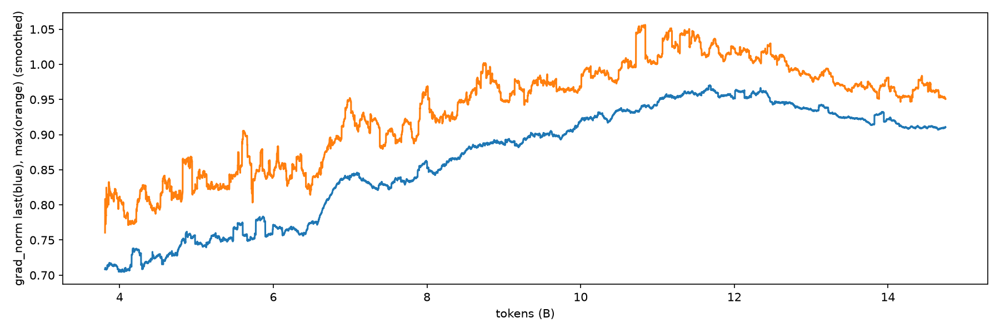

# Custom 300M Param GPT LLM
## At a glance:
This repo contains a custom-made ~300 million parameter GPT-style language model, 
with the tokenizer, architecture, and training stack written 
entirely from scratch. The model was trained on roughly 14.75 Billion tokens, 
of OpenWebText2, on two RTX 3090s for ~94.5 hours, for $~2.7\times 10^{19}$ FLOPs (estimated with 6ND) of compute. Final loss was 
around 3.1.

## Results at a glance:

| Parameters               | 300,648,448                                |
|:-------------------------|:-------------------------------------------|
| Context / Vocab          | 1,024 / 127k    byte-level BPE         |
| Training Data            | OpenWebText2, 14.75B tokens, 1 epoch       |
| Hardware                 | 2x RTX 3090                                |
| Wall-clock               | ~94.5 hours of training in 2 sessions.     |
| Final Training Loss      | 3.11                                       |
| Loss on slice of dataset | 3.03 (training distribution, not held out) |
| Hellaswag, 0-shot        | acc_norm 0.325, acc 0.297 (random = 0.25)  |

### Sample generations
- Prompt: 1+1=
  - **Response:**
        
        1+1=100000*1000*1000000
        
        0 0 0 0 0 0 0 0 0 0 0
        
        The size of the buffer is defined as the number of bytes in the memory address.
        
        We could have written:
        
        mov eax, d⭐ ptr [esi] ; mov edi, d⭐ ptr [esi+ecx], esi;
        
        However, this will result in an infinite loop, because the value of the second argument (esp) will be equal to
  - Notes: base model, no arithmetic capability; continues text from code like context. 
- Prompt: The history of the
  - **Response:**
        
        The history of the US and the UK’s relationship with the EU is a complex one, but it has been a long-running one.

        It began in the early 1970s when the UK was granted membership of the European Economic Community (EEC) after the Second World War. The UK joined the EEC in 1973upt the terms of the Treaty of Rome, which established the bloc as a single market for goods and services.

        In 1979, the UK joined the European Economic Community (EEC) as an observer state, and
  - Notes: Fluent English, however factually incorrect. the EEC "observer state" line is false.
## Quickstart Guide
Weights can be downloaded through [gpt300m_bf16.pt](gpt300m_bf16.pt). They are stored via Git LFS. vocab_id.vocab is required, as well as the tokenizer.   

The model can be used by cloning the repository, creating a new .venv, then installing requirements.txt and finally running python3 query_llm.py [prompt]

## Architecture
16 Pre-LN blocks, d_model 1024, 16 query heads sharing one K/V head (MQA), RoPE, GELU FFN at 4x width, tied embeddings, ~170M Parameters in blocks, ~130M parameters in Embedding.

Line by line walkthrough is planned.

## Tokenizer
Byte-level BPE trained completely from scratch. Has a 127k vocab, GPT-2 style regex pre-split. I used byte-level encoding to cover the entire byte range, meaning it is impossible for any input to not have a comparable token. The model only learned tokenization on strings appearing >3 times, saving memory. This did however mean it dropped rare words before merging.

## Data
Trained on [OpenWebText2](https://huggingface.co/datasets/segyges/OpenWebText2), tokenized into flat int32 memmap of all ~14.75B tokens. The knowledge cutoff is from around 2020. 
The data contains a substantial amount of non-English text (German, Russian, Portugese and Korean are what I have noticed), so I have observed it swap languages. In my interaction with it, english dominates.

## Training Setup
The model was trained using AdamW (betas 0.9/0.95, weight decay 0.1, on 2d weights only). 
Peak learning-rate of 3e-4, 600 warmup steps, and cosine decay active over ~150K optimizer steps.
DDP with gradient accumulation giving ~98k tokens per update.

Learning schedule.

Gradient norm curve. Note that this is only tracked after the resume.

## Debugging
Initially when I first embarked on this project, I used 6 layers. This worked, somewhat. It did successfully understand sentences, and could articulate related ideas, however it lacked proper grammatical structure.
I suspected that this model needed more weights, as it couldn't understand proper English.
I then reran training with 10 more layers, and still, the model predicted only common tokens at steps 11k+ and hovered with a loss of 7.5.
I the issue was that the default N(0,1) embedding init tied to the output head gave huge initial logits.
I figured this issue out by first checking the initial loss, and ran a batch overfit test to see whether it was training, and a small config run. 
My solution was configuring std to be 0.02 init with residual-projection scaling. I also swapped from RAdam to AdamW with decoupled weight decay (standard in LLM). I cannot attribute any improvement to it.
As a result, the initial loss was 11.9 ($\approx \ln 127k$) and in the small-config test the plateau broke by step ~150. At about micro-step 11,000 the first run sat at ~7.5 while the fixed run was at ~4.5. It is worth noting in the first run loss was a single batch sample, as it was not averaged.
I later found the init was the real cause, so I cannot confirm whether the capacity was a true issue.
I also faced significant issues with memory when training the tokenizer, as it kept loading more and more tokens. I solved this by culling anything below 3 mentions in the corpus, and pruning processed data. This did however mean it dropped rare words before merging.

## Engineering Notes
I had issues training the model; During training, the computer tripped a breaker, killing the training at ~31% progress. I resumed from the last checkpoint. Before the crash, 
logs were only captured from notebook output, which is missing ~195M tokens just before the resume point. After resuming, I introduced better logging, including gradient norm.
The pre-crash learning-rate values in the LR plot are partly a reconstruction from the schedule.  

## Limitations and what I'd do differently

- There is no EOS token.
  - This is a very big oversight. The model will not stop talking until it runs out of token length.
  - I will try to solve this after SFT.
- Whitespace only chunks dropped during BPE training
  - This causes the model to chew through tokens if it wants white space, and also makes the computation harder
- a regex that glues punctuation to neighboring words.
  - Wastes vocabulary slots, and fragments numbers. GPT-4 style regex would be more optimal
- different vocab size.
  - 127k vocab is large for this model. (~43% of the model is embedding)
- no kv cache in the generation code
  - I will probably implement this soon (inference only).
- base model
  - it continues text, isn't really helpful. I will solve this in SFT
- it hallucinates
  - it makes stuff up but thats expected it's a tiny model.

If I did this again I would reduce the vocab size, add EOS tokens, use RMSNorm, SwiGLU, GQA, add a KV cache, and obviously fine tune the model.

## TODO: 
- [ ] Fine tune the model
- [ ] add in KV cache

If the model proves capable enough:
- [ ] Add RAG
- [ ] Add the ability to do math
- [ ] Give it a sandbox environment for code

## Other

I would like to thank OpenWebText2 for the open-source dataset, and lm-eval for providing free evaluation tools.
License: MIT